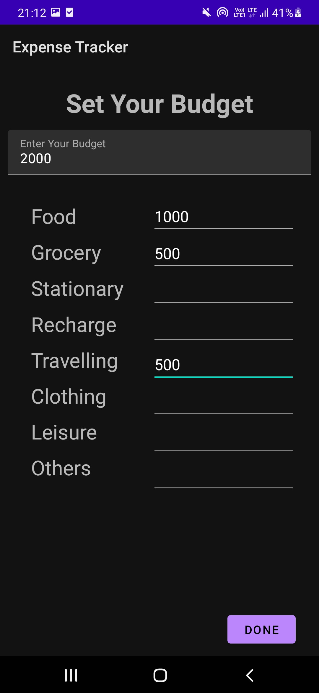
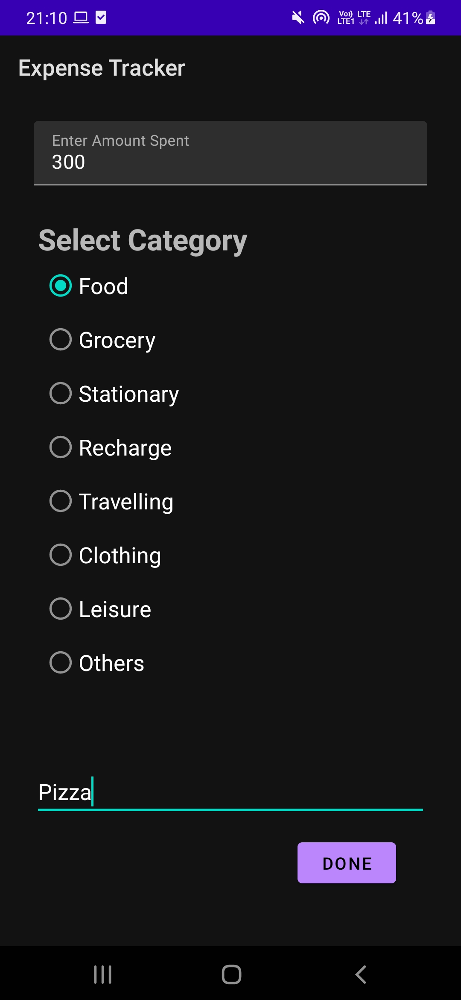
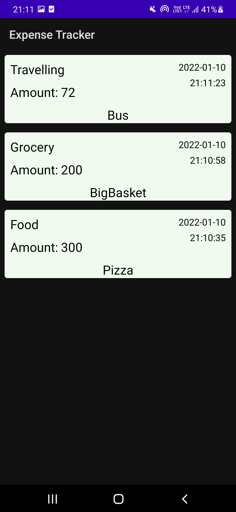

# Expense Tracker App

## **Problem Statement**

Usually, people find spending money lavishly to be easy but doing so meticulously to be difficult. But of course, tracking one's expenses and spending money with a thought and plan is important to prevent unnecessary expenditures, which results in savings that could come in handy in the future. Thus, a tool to help people achieve exactly that would be great.

## **Solution**

For the above problem, we propose a mobile app-based solution, named aptly as "Expense Tracker". This app allows users to enter in their budget as well as enter in every transaction they make across various categories such as food, grocery, clothing, travel etc. It then provides the options to display all the expenditures made so far both as a beautiful pie chart and a good old list. Being a mobile app makes it very convenient to use. Additionally, it requires no internet which ensures that all the data is stored locally itself. Thus, it serves as a great solution to the above problem. 

## **Screenshots**

## **Functionality & Concepts used**

The App has a very simple and interactive UI which makes it easier to understand the flow of the app. Following are few android concepts used to achieve the functionalities in the app:

- `Diffrent screen layouts`: The app employs a variety of layouts, each of which provides its own unique functionality (Example: Linear Layout, Relative Layout, Constraint Layout).
- `Android Jetpack Navigation`: We also use Android Jetpack Navigation which simplifies the implementation of navigation while also assisting us in visualising the navigation flow of our application.
- `Recyclerview`: We made use of recycler view to display all the past transactions made.
- `LiveData & Room Database`: We are using LiveData to update & observe any changes in the budget and transactions made by the user, so as to update it to local databases using Room.

## **Application Link & Future Scope**

The application is currently in the testing phase at RIT with a limited number of users. You can access the pre-release of our app from the [releases]  section.

In the future, we plan to add more features such as automatically reading SMS messages to keep track of all online transactions, more options to better visualize expenditures and many more. This would make the app a full-fledged expense tracker which will surely come in handy to our college mates and others as well.
